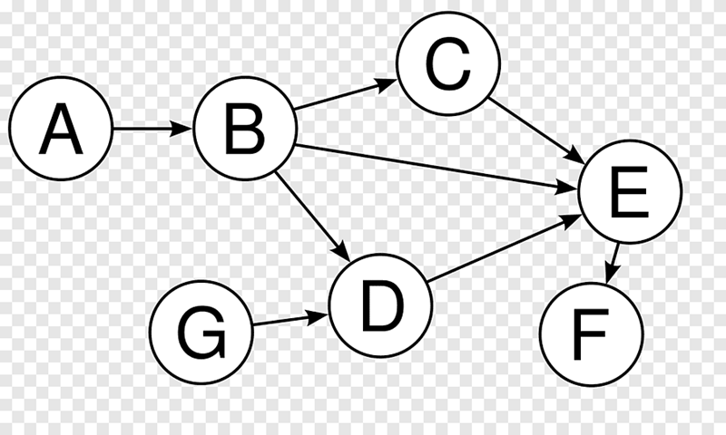
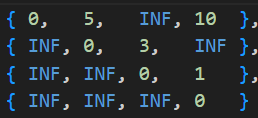
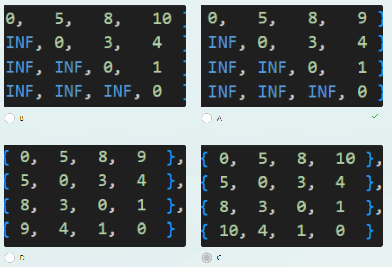
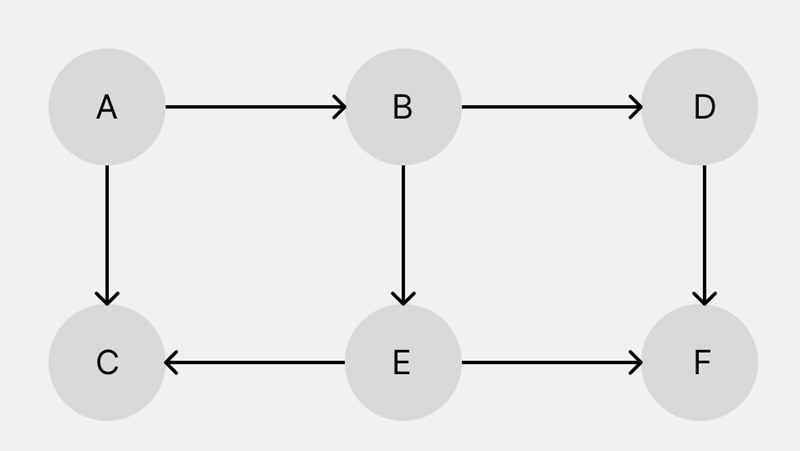

## Select one of the correct order for this graph using topological sort



>A, B, G, D, C, E, F **<- Correct**

>A, B, C, E, F, D, G

>A, B, C, D, E, F, G

>A, B, C, E, F, G, D

## You are given a graph with matrix representation, choose correct final graph using Floyd algorithm INF = infinity





**Answer : A**

## You are given a string "aab#abcaaaba" for kmp algorithm, choose correct answer when we use prefix_function
>0 1 0 0 1 0 0 1 2 2 3 1 **<- Correct**

>0 1 0 0 1 0 0 1 1 1 2 1

>0 0 0 0 1 0 0 1 1 1 2 1

>0 0 0 0 1 0 0 1 2 2 3 1

## What is the avg-case time complexity of the Floyd Warshall algorithm? V-number of vertices.

>O(V^3) **<- Correct**

>O(V^2)

>O(V)

>O(V*logV)

## Why Dijkstra’s Algorithms fails for the Graphs having Negative Edges ?
> Answer
## You are given a map as 2d-array with char 1 (land) and 0 (water), your task to find largest island, you can only move horizontally or vertically.

**Write pseudocode of your dfs**

```c++
Input:
4 5 
11000 
11000 
00100 
00011

Output:
4
```

## You are given a directed graph with matrix representation. Find cycle of this graph.
**Write pseudocode for this problem.**
```c++
Input:
4                 // 4 vertices
0 1 0 0
0 0 1 0
1 0 0 0
0 1 0 0

Output:
0->1->2
```

## Why do we use graph coloring in DFS?
> Answer

## If graph begins at node A, which algorithm would explore the nodes in the following order: A, B, D, F, E, C?



>Breadth-First Search (BFS)

>Neither DFS nor BFS

>Depth-First Search (DFS) **<- Correct**

>Both DFS and BFS

## What is the worst-case time complexity of the **Knuth-Morris-Pratt (KMP)** algorithm for finding all occurrences of a pattern in a text? n - size of text, m - size of pattern


>O(mn)

>O(n + m) **<- Correct**

>O(m^2)

>O(n^2)

## What fundamental technique used in the Knuth-Morris-Pratt algorithm enables efficient string matching compared to other algorithms?

>Implementing a prefix-based pattern preprocessing **<- Correct**

>Utilizing a rolling hash function for pattern comparison

>Employing dynamic programming to optimize substring searches

>Utilizing parallel processing for faster pattern matching

## Consider a text string T of length n and a pattern string P of length m. What is the average-case time complexity of the Rabin-Karp algorithm for finding all occurrences of P in T?

>O(n^2)

>O(m^2)

>O(mn)

>O(n + m) **<- Correct**
